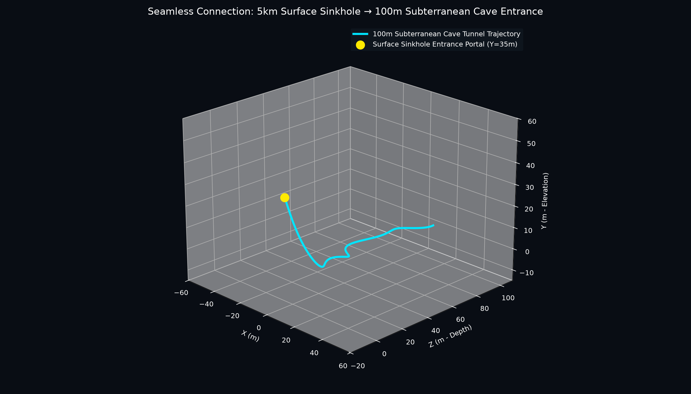
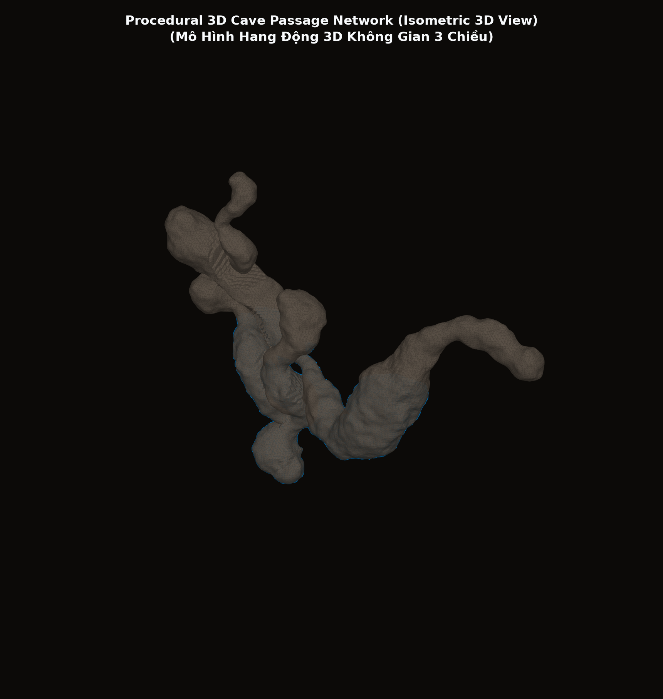
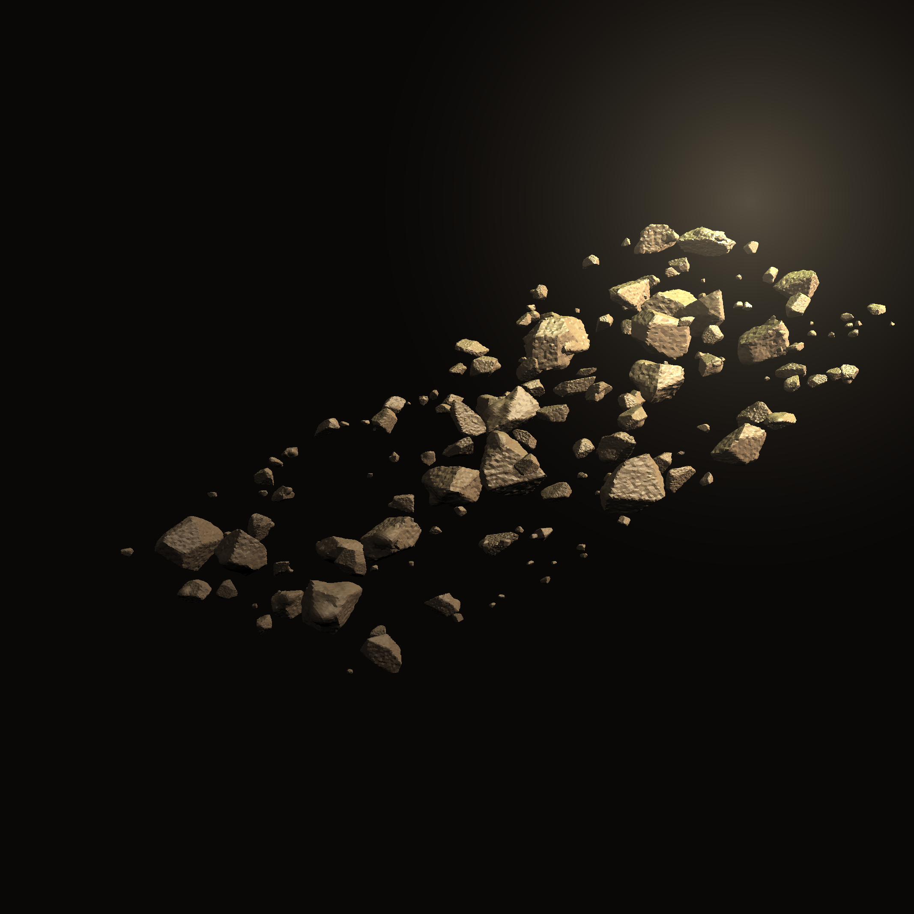
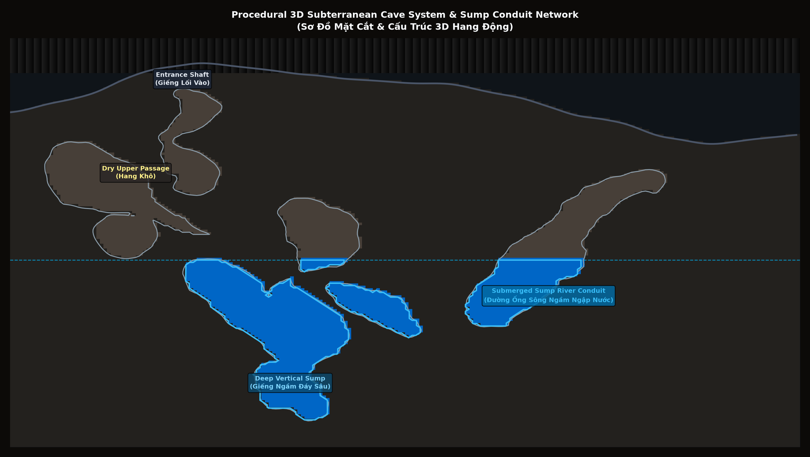
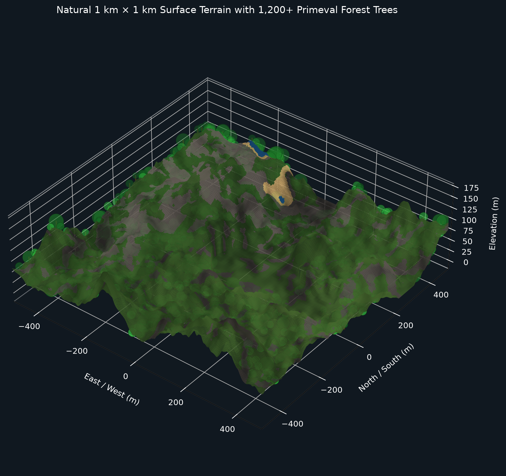
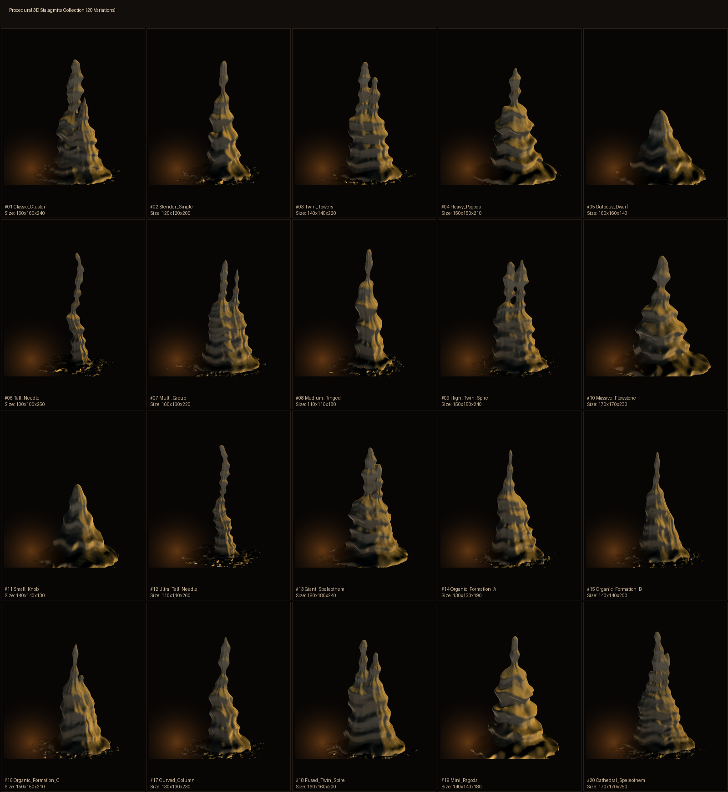
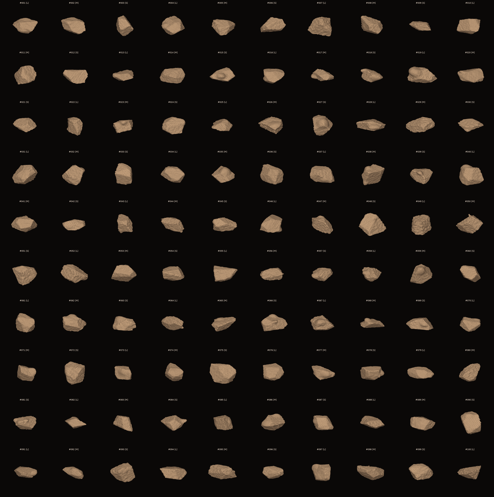

# Python 3D Cave Generator & Godot 4 Cave Diving Game

A powerful Python toolkit for procedural 3D cave terrain generation, speleothems (stalactites & stalagmites), boulders/debris, underground lakes, and automated export into a ready-to-play **Godot 4** 3D game project.

---

## 📸 Demo Screenshots & Visual Assets

| 100m Cave Game Render (Godot 4) | 3D Cave Mesh Overview |
| :---: | :---: |
|  |  |

| Boulders & Debris Details | Subterranean Cave & Water System |
| :---: | :---: |
|  |  |

| 5km Terrain Surface | Stalactite Gallery (100 Variants) |
| :---: | :---: |
|  |  |

| Stalagmite Gallery (20+ Variants) | Boulder Gallery (100 Variants) |
| :---: | :---: |
|  |  |

---

## ✨ Features

- **Large-Scale 100m 3D Cave Terrain Generation:**
  - Uses 3D noise (`pyfastnoiselite`) combined with Marching Cubes (`scikit-image`, `trimesh`).
  - Supports generation of winding tunnels, massive main caverns, water channels, and detailed cave ceilings/floors.

- **Procedural Asset Generators:**
  - **Stalactite Generator:** Generates realistic stalactites hanging from cave ceilings.
  - **Stalagmite Generator:** Generates stalagmites rising from cave floors.
  - **Boulder & Debris Generator:** Generates scattered rocks, debris, and boulders across the cave ground.

- **Automated Integration with Godot 4 Engine:**
  - Exports standard `.glb` and `.obj` 3D model formats fully compatible with Godot 4 / Blender.
  - Automatically generates a complete **Godot 4** project (`cave-diving-game/`) including:
    - **World Environment:** Tuned subterranean lighting, Volumetric Fog, and PBR Ambient Lighting.
    - **Player Character:** Diver's headlamp (SpotLight3D + OmniLight3D fill) with FPS / Cave Diving controls.
    - **Physics & Materials:** Auto-generated `StaticBody3D` colliders and PBR Materials for rock, sediment, and water.

---

## 📁 Project Directory Structure

```text
python-cave-map/
├── build_100m_cave_game.py       # Main script building full 100m cave & exporting Godot 4 project
├── cave_generator.py             # Basic 3D cave mesh generator
├── cave_tunnel_generator.py      # Cave tunnel generator script
├── terrain_surface_generator.py  # 5km terrain surface generator
├── stalactite_generator.py       # Stalactite asset generator
├── stalagmite_generator.py       # Stalagmite asset generator
├── boulder_generator.py          # Boulder & rock asset generator
├── batch_stalactite_generator.py # Batch generator for 100 stalactite pack
├── batch_stalagmite_generator.py # Batch generator for 20+ stalagmite pack
├── batch_boulder_generator.py    # Batch generator for 100 boulder pack
├── cave-diving-game/             # Auto-generated Godot 4 game project directory
└── *.png / *.glb / *.obj         # Generated 3D models and preview screenshots
```

---

## 🛠️ Installation & Setup

### 1. Prerequisites
- **Python:** 3.8+
- Required Python packages:
  ```bash
  pip install numpy scipy scikit-image trimesh pyfastnoiselite matplotlib pillow
  ```

### 2. Generate 100m Cave & Godot 4 Project
Run the main build script to generate the 3D cave mesh, export `.glb` models, and set up the Godot 4 project:
```bash
python build_100m_cave_game.py
```

Output assets created:
- 3D models: `cave_map.glb` and `cave_boulders_debris.glb`.
- Pre-configured Godot 4 project directory: `cave-diving-game/`.

### 3. Run Individual Asset Generators (Optional)
- **Generate Stalactite Pack:**
  ```bash
  python batch_stalactite_generator.py
  ```
- **Generate Stalagmite Pack:**
  ```bash
  python batch_stalagmite_generator.py
  ```
- **Generate Boulder Pack:**
  ```bash
  python batch_boulder_generator.py
  ```

---

## 🎮 Running in Godot 4 Engine

1. Download and install [Godot Engine 4.x](https://godotengine.org/).
2. Open Godot Engine -> Click **Import** -> Select `cave-diving-game/project.godot`.
3. Click **Play** (F5) to explore the 3D subterranean cave environment!

---

## 📄 License

Open-source project created for procedural 3D generation research, learning, and game development.
